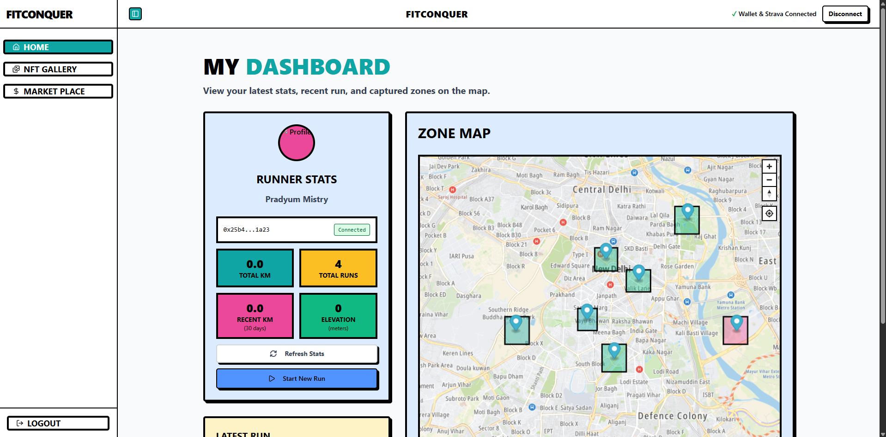
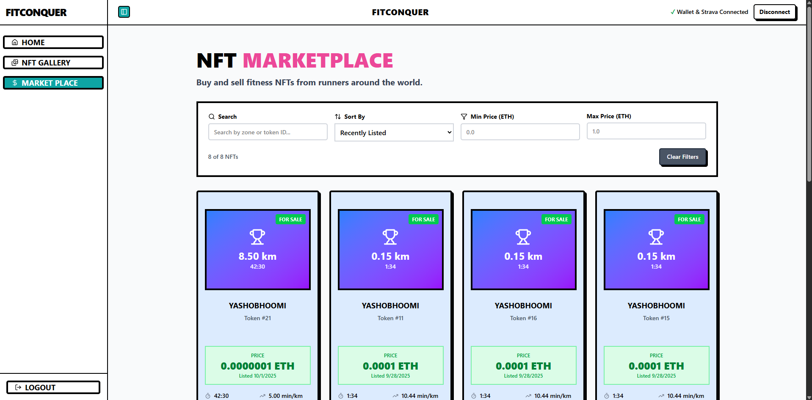
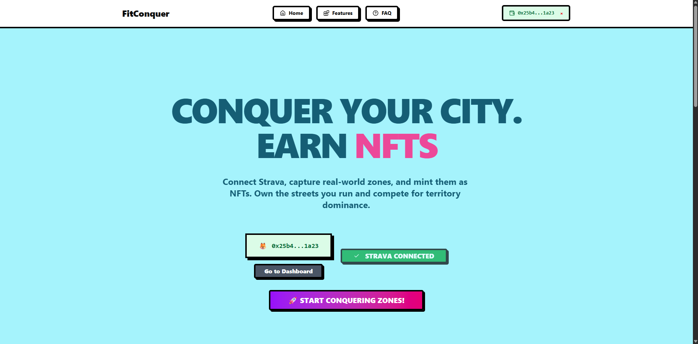

# Runft

> **Runft turns your runs into unique generative NFTs.**  
> Fitness meets Web3 — every run becomes a collectible asset you can showcase or trade.

---

## 🔗 Demo & Links

- 🌐 [Live Demo](https://runft.vercel.app)

---

## 📸 Screenshots

  
  
<em>Dashboard - Track your runs and NFT collection</em>

  
  
  
<em>Run Details - View your run statistics and generated NFT</em>

  
  
  
<em>Marketplace - Browse and trade Runft NFTs</em>

---

## ⚙️ How It Works

1. **Connect Wallet** → Secure login with MetaMask.
2. **Sync Strava/GPS** → Import your run details.
3. **Go for a Run** → Distance, route, timestamp captured.
4. **Generate NFT** → Deterministic art from route + timestamp.
5. **Marketplace** → Buy, sell, and showcase Runfts.

---

## 🛠️ Tech Stack

| Layer               | Tech                               |
| ------------------- | ---------------------------------- |
| **Frontend**        | React, ShadCN, Tailwind CSS        |
| **Smart Contracts** | Solidity, Arbitrum Sepolia         |
| **Data**            | Strava API, GPS                    |
| **Maps**            | TomTom API for route visualization |

---

## ✨ Features

- 🎨 **Generative Art** — Every run mints a unique design based on timestamp + GPS data.
- 🛒 **Marketplace** — Trade your runs as NFTs.
- ⛓️ **On-chain Provenance** — Runs become verifiable digital history.

---

## 👥 Team

Built with ❤️ at **ETHGlobal 2025** by **Team Runft**
